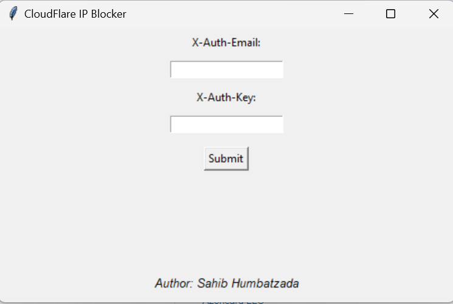
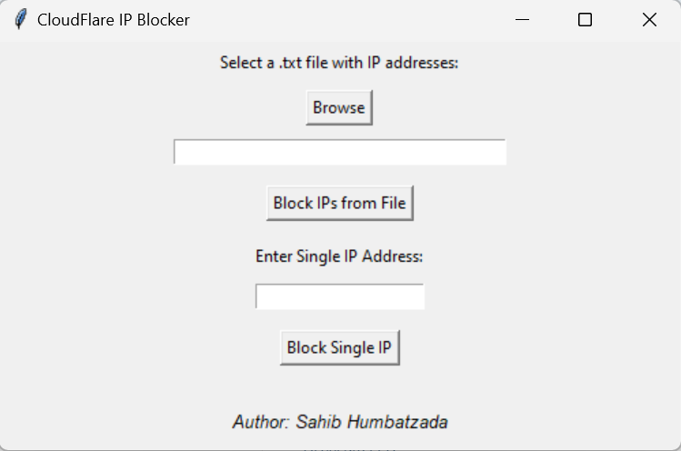

# Hi, I'm Dr4ks! 👋

## 🚀 About Me
I'm a Cyber Security student and open always to learning.

## 🔗 Links
[](https://www.linkedin.com/in/Dr4ks/)
[](https://www.hackerrank.com/Dr4ks)
[](https://tryhackme.com/p/Dr4ks)
[](https://app.hackthebox.com/profile/1037035)
[](https://github.com/Dr4ks)


# CloudFlare IP Blocker

## Description

This application is used to block malicious ip addresses on CloudFlare.

There 2 options are available.


**First**: You can enter `.txt` file which contains `IP Addresses` and seperated with each other line by line.

*Example:*
```bash
127.0.0.1
127.0.0.1
127.0.0.1
```

**Second**: You can enter single `IP Address` to add into Block List.


## Installation

```bash
git clone https://github.com/Dr4ks/cloudflare_ip_blocker
cd cloudflare_ip_blocker
pip install -r requirements.txt
```


## Usage

You can use this software in two ways. Before implementing both ways, you need to change `account_id` and `list_id` with your own system's values on `cdf_endpoint` variable.

1.

```bash
py main.py # gives you one session
```

2.

```bash
pyinstaller --onefile --noconsole main.py  # gives you executable on dist folder for later use
```


## Demonstration


Authentication Page:



Dashboard Page:

